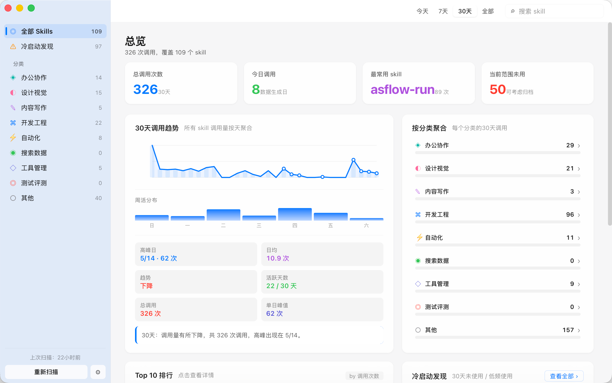
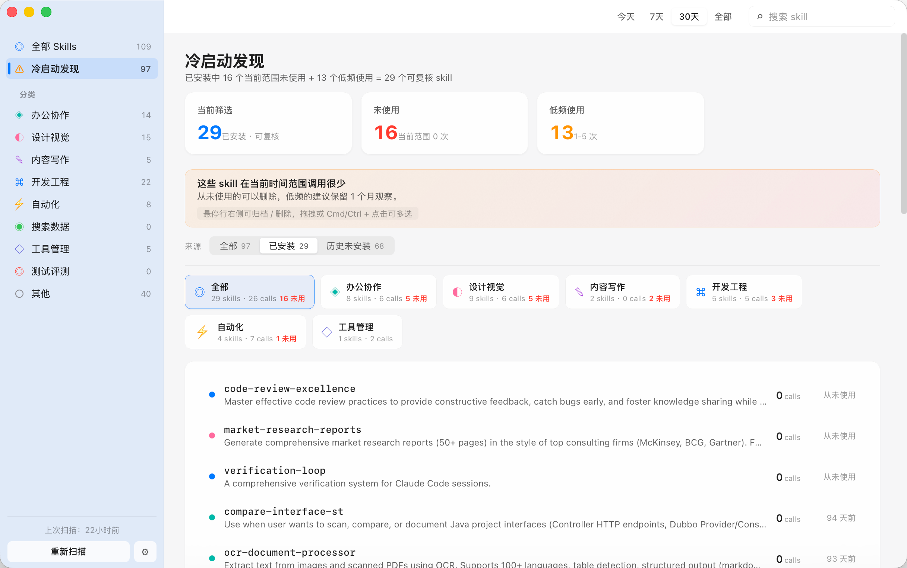

# SkiLens


SkiLens 是一个本地优先的 macOS 桌面应用，用来查看 Claude Code 和 Codex 技能的使用情况。

它会扫描本机的 skill 定义和本地会话日志，并生成技能调用统计：调用趋势、常用技能排行、分类分布、冷启动候选、技能详情和最近证据。

## 为什么需要 SkiLens

AI 编程工具用久之后，skill、agent、plugin 很容易越积越多。过一段时间后，你通常很难回答这些问题：

- 哪些 skill 真的被调用过？
- 哪些 skill 装了但几乎不用？
- 哪些分类膨胀得太快？
- 哪些历史 skill 应该归档，而不是直接删除？
- 哪些信号是真调用，哪些只是辅助证据？

SkiLens 的目标是把这些问题变成一个本地桌面看板，而且不上传你的日志和 skill 内容。

## 功能

- 基于 Tauri 2 的 macOS 原生桌面应用。
- 支持今天、7 天、30 天、全部时间范围。
- 保留原 Python MVP 的统计语义。
- 只把斜杠命令和显式 `Skill` / `skill` tool_use 计为调用。
- 同一会话里，斜杠命令优先于 Skill tool_use。
- skill instruction、agent request、`load_skills`、`read-SKILL.md` 等只作为证据，不计调用。
- 排除 `~/.claude/plugins/cache` 和 `~/.codex/plugins/cache` 里的插件缓存。
- 冷启动视图用于复核从未使用和低频使用的 skill。
- 归档历史跨重新扫描持久保留。
- 删除 skill 时移动到 `~/.Trash/skills-stats`，不是直接永久删除。
- 技能详情页支持趋势、最近证据、相关 skill、`SKILL.md` 预览。
- 保留旧版 JSON / JS 导出兼容性。

## 安装

### 从 Release 安装

从 GitHub Releases 下载最新 `.dmg`，打开后把 SkiLens 拖到 Applications。

如果 Releases 页面暂时没有 `.dmg`，请先从源码构建。

如果 macOS 因为未签名或未公证阻止打开，可以右键应用并选择 **打开**。更完整的说明见 [安装文档](docs/INSTALLATION.md)。

### 从源码构建

需要：

- macOS 13 或更新版本，推荐 Apple Silicon 或 Intel Mac。
- Node.js 20 或更新版本。
- Rust stable toolchain。
- Xcode Command Line Tools。

```bash
npm install
npm run tauri:build
```

构建产物会生成在：

```text
src-tauri/target/release/bundle/
```

## 开发

```bash
npm install
npm run tauri:dev
```

常用检查：

```bash
npm run build
npm run test:rust
npm run check
```

## 截图

### 总览



### 冷启动发现



## 项目结构

```text
src/                         React 18 + TypeScript 前端
src/components/              通用组件和 macOS 窗口外壳
src/components/views/        总览、分类、冷启动、详情视图
src/lib/                     前端 API、偏好设置和数据处理
src-tauri/                   Tauri 2 Rust 应用壳和命令
src-tauri/core/              扫描器、兼容性规则和测试
docs/                        安装、发布和仓库设置文档
```

更完整的数据流和模块边界见 [架构说明](docs/ARCHITECTURE.md)。

## 统计规则

SkiLens 会严格保留原 Python MVP 的业务规则：

- `invocations` 只统计 Claude 斜杠命令和显式 `Skill` / `skill` tool_use。
- 同一 `(session, skill)` 中，斜杠命令优先于 Skill tool_use。
- skill instruction、agent request、`load_skills`、`read-SKILL.md` 等支持信号只作为 evidence。
- `~/.claude/plugins/cache` 和 `~/.codex/plugins/cache` 下的插件缓存不会被识别为已安装 skill。
- 归档隐藏历史会在重新扫描后继续保留。
- JSON / JS 导出保持旧版 dashboard 兼容。

## 隐私

SkiLens 是本地优先应用：

- 读取本机 skill 目录和 Claude/Codex 本地日志。
- 本地数据库位于 `~/Library/Application Support/skills-stats/`。
- 不上传日志、skill 内容或使用统计。
- 不需要账号。

在处理包含客户、公司、项目路径或敏感提示词的机器时，请先阅读 [隐私说明](PRIVACY.md)。

## 安全说明

- 归档只会在 SkiLens 中隐藏 skill，不会删除磁盘文件。
- 删除会把已安装 skill 目录移动到 `~/.Trash/skills-stats`。
- 没有当前安装路径的历史 skill 只能归档，不能从磁盘删除。

## 参与贡献

欢迎提交 issue 和 PR。开始前请阅读 [贡献指南](CONTRIBUTING.md)，并运行：

```bash
npm run check
```

安全问题请按 [安全策略](SECURITY.md) 处理。

仓库 Topics、分支保护、Release 设置等见 [GitHub 设置清单](docs/GITHUB_SETUP.md)。

## 路线图

- 签名和公证的 macOS Release。
- 更完整的产品截图和短演示视频。
- 可选的 FSEvents 自动重新扫描。
- 更多扫描器兼容性测试样例。
- 归档历史导入/导出 UI。

## 许可证

MIT。见 [LICENSE](LICENSE)。
