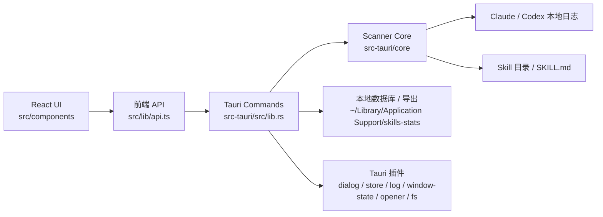

# 架构说明

这份文档给贡献者快速说明 SkiLens 的模块边界、数据流和不能破坏的兼容性规则。

## 总览

SkiLens 是本地优先的 macOS 桌面应用。前端只负责展示、交互和调用 Tauri 命令；扫描、统计、文件操作和本地持久化都在 Rust 侧完成。

## 前端

- `src/App.tsx` 保留顶层状态、查询编排和视图选择。
- `src/components/` 放 macOS 外壳、侧栏、工具栏、通用卡片和图表组件。
- `src/components/views/` 放页面级视图：总览、分类、冷启动、技能详情。
- `src/lib/api.ts` 封装 Tauri command 调用。
- `src/lib/preferences.ts` 管理前端偏好设置。
- `src/lib/viewHelpers.ts` 放视图层数据转换，避免把展示逻辑堆进组件。

前端改动应保持 macOS source-list 风格，不要把扫描规则复制到前端实现。

## Rust 后端

- `src-tauri/src/lib.rs` 是 Tauri command 边界，负责把前端请求转给后端逻辑。
- `src-tauri/core/` 放扫描器、兼容性规则、数据模型和测试。
- 文件删除应走安全路径：已安装 skill 移动到 `~/.Trash/skills-stats`，没有安装路径的历史 skill 只能归档。
- 本地数据默认写入 `~/Library/Application Support/skills-stats/`。

Rust 侧是业务规则的唯一可信来源。涉及统计语义、归档、导出兼容或路径安全的修改，需要补测试。

## 数据流

1. 用户打开应用，前端通过 Tauri command 请求扫描结果。
2. Rust 后端读取本机 skill 目录和 Claude/Codex 本地日志。
3. 扫描器按兼容性规则生成调用、证据、分类、趋势和冷启动数据。
4. 后端写入或读取本地数据库、归档状态和导出文件。
5. 前端用 TanStack Query 获取数据并渲染视图。

## 不能破坏的兼容性规则

这些规则来自原 Python MVP，必须保持一致：

- 只有斜杠命令和显式 `Skill` / `skill` tool_use 计为调用。
- 同一会话中，斜杠命令优先于 Skill tool_use。
- skill instruction、agent request、`load_skills`、`read-SKILL.md` 等辅助信号只作为 evidence。
- `~/.claude/plugins/cache` 和 `~/.codex/plugins/cache` 下的插件缓存不识别为已安装 skill。
- 归档隐藏历史跨重新扫描保留。
- JSON / JS 导出保持旧版 dashboard 兼容。

如果修改以上行为，必须同步更新 `src-tauri/core/tests/scanner_compat.rs`，并在 `CHANGELOG.md` 明确记录。

## 本地数据和隐私边界

SkiLens 不需要账号，也不上传日志、skill 内容或统计结果。贡献者添加新功能时应默认遵守：

- 不引入远程采集。
- 不把本地日志或 skill 内容写入崩溃报告、遥测或第三方服务。
- 文件系统访问继续限制在必要路径内。
- 导出文件必须由用户主动触发并选择路径。

## 贡献入口

- 开发和 PR 流程见 [贡献指南](../CONTRIBUTING.md)。
- 安装和源码构建见 [安装文档](INSTALLATION.md)。
- Release 流程见 [发布文档](RELEASE.md)。
- GitHub 仓库设置见 [GitHub 设置清单](GITHUB_SETUP.md)。
